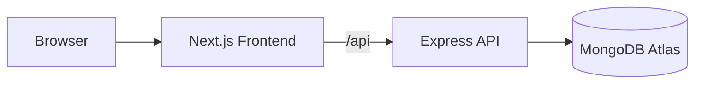

# Architecture

## 1. System Overview
SPID is a split frontend/backend platform:
- Frontend: Next.js app (UI, routing, role-aware interactions)
- Backend: Express API (auth, domain logic, RBAC enforcement)
- Database: MongoDB Atlas (persistent records)

## 2. Runtime Components
### Frontend
- `src/app`: route pages
- `src/components`: UI primitives and dashboard layout
- `src/context/AuthContext.tsx`: auth session and user state
- `src/lib/api.ts`: centralized axios API client

### Backend
- `server/src/routes`: endpoint definitions
- `server/src/controllers`: request handling/business logic
- `server/src/middleware`: `authMiddleware`, `roleMiddleware`
- `server/src/models`: mongoose schemas

## 3. Core Design Decisions
- RBAC is enforced in backend routes, not only in UI
- Viewer onboarding is approval-gated (`pending` -> admin decision)
- Sensitive operations (delete/block/approve/reject) use explicit confirmations in UI
- Cascade deletions are transaction-based for consistency

## 4. Role Matrix
| Role | Core Permissions |
|---|---|
| Admin | Full CRUD, approvals, login history, faculty password management |
| Faculty | Student edit workflows, student documents, student block/unblock |
| Student | Student-scoped read access |
| Viewer | No access until approved |

## 5. Request Lifecycle
1. User triggers UI action.
2. Frontend calls API via `src/lib/api.ts`.
3. Backend route applies auth + role middleware.
4. Controller executes validation and DB updates.
5. JSON response updates client state/UI.

## 6. Security Model
- JWT auth with cookie support
- Password hashing via `bcryptjs`
- Google OAuth support through passport
- CORS allowlist from environment + hosted domains
- Route-level role authorization for protected endpoints

## 7. Data and Integrity
- Key models: `User`, `Student`, `Subject`, `Performance`, `AcademicRecord`, `ActivityLog`
- Linked user/student/faculty synchronization on updates
- Cascade cleanup for student/faculty delete flows

## 8. Operational Topology
- Frontend: Vercel
- Backend: Render
- Database: Atlas

See deployment details in [DEPLOYMENT.md](DEPLOYMENT.md).

## Document Metadata
- Last Updated: February 25, 2026
- Status: Active
