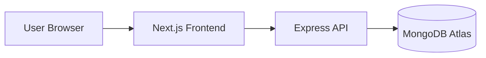

# Architecture Guide

## Documentation Hub
- Main Overview: [`README.md`](README.md)
- Architecture: [`ARCHITECTURE.md`](ARCHITECTURE.md)
- Setup: [`SETUP.md`](SETUP.md)
- Quick Start: [`QUICK_START.md`](QUICK_START.md)
- Deployment Guide: [`DEPLOYMENT.md`](DEPLOYMENT.md)
- Deployment Checklist: [`DEPLOYMENT_CHECKLIST.md`](DEPLOYMENT_CHECKLIST.md)
- Deployment Quick Reference: [`DEPLOYMENT_QUICK_REFERENCE.md`](DEPLOYMENT_QUICK_REFERENCE.md)
- Documentation Index: [`DOCUMENTATION_INDEX.md`](DOCUMENTATION_INDEX.md)
- Enterprise Report: [`ENTERPRISE_TRANSFORMATION.md`](ENTERPRISE_TRANSFORMATION.md)
- Executive Summary: [`TRANSFORMATION_SUMMARY.md`](TRANSFORMATION_SUMMARY.md)

## Contents
- [System Context](#system-context)
- [Runtime Topology](#runtime-topology)
- [Layer Responsibilities](#layer-responsibilities)
- [Request Lifecycle](#request-lifecycle)
- [Security Model](#security-model)
- [Domain APIs](#domain-apis)
- [Deployment View](#deployment-view)
- [Scalability Notes](#scalability-notes)

## System Context
SPID is a full-stack college performance platform designed for three roles:
- Admin
- Faculty
- Student

It combines operational workflows (records, subjects, performance) with analytics and audit visibility.

## Runtime Topology

## Layer Responsibilities
### Frontend (Next.js)
- Role-aware navigation and page rendering
- Auth session handling via context
- Dashboard visualization and responsive UI
- API communication via centralized Axios client

Key files:
- `src/context/AuthContext.tsx`
- `src/lib/api.ts`
- `src/components/dashboard/*`
- `src/app/*`

### Backend (Express)
- Authentication and authorization
- Domain-specific REST endpoints
- Data validation and business logic
- Activity and login history tracking

Key files:
- `server/src/server.js`
- `server/src/routes/*`
- `server/src/controllers/*`
- `server/src/middleware/authMiddleware.js`

### Data Layer (MongoDB)
Primary models:
- `User`, `Student`, `Faculty`, `Subject`, `Performance`
- `AcademicRecord`, `ActivityLog`

## Request Lifecycle
1. User action triggers frontend event.
2. Frontend sends request through `src/lib/api.ts`.
3. Backend route resolves middleware and controller.
4. Controller runs business logic + DB operations.
5. API returns JSON response.
6. Frontend updates state and UI.

## Security Model
- JWT-based authentication
- Cookie and bearer-token support
- Role-based API authorization
- CORS origin validation
- Password hashing with bcrypt

## Domain APIs
- `/api/auth`
- `/api/students`
- `/api/faculty`
- `/api/subjects`
- `/api/performance`
- `/api/dashboard`
- `/api/academic`
- `/api/ai-analytics`
- `/api/activities`

## Deployment View
- Frontend: Vercel
- Backend: Render
- Database: MongoDB Atlas

Production URL:
- `https://smart-performance-dashboard-git-main-srixenos-projects.vercel.app`

## Scalability Notes
- Keep controllers domain-focused.
- Add caching for heavy analytics endpoints.
- Add integration and E2E tests for release confidence.
- Add centralized logging/metrics for production observability.

## Document Metadata
- Version: `2.0`
- Last Updated: `February 24, 2026`

