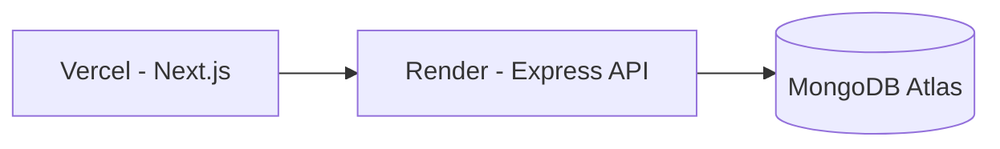

# Complete Deployment Guide

## Documentation Hub
- Main Overview: [`README.md`](README.md)
- Architecture: [`ARCHITECTURE.md`](ARCHITECTURE.md)
- Setup: [`SETUP.md`](SETUP.md)
- Quick Start: [`QUICK_START.md`](QUICK_START.md)
- Deployment Guide: [`DEPLOYMENT.md`](DEPLOYMENT.md)
- Deployment Checklist: [`DEPLOYMENT_CHECKLIST.md`](DEPLOYMENT_CHECKLIST.md)
- Deployment Quick Reference: [`DEPLOYMENT_QUICK_REFERENCE.md`](DEPLOYMENT_QUICK_REFERENCE.md)
- Documentation Index: [`DOCUMENTATION_INDEX.md`](DOCUMENTATION_INDEX.md)
- Enterprise Report: [`ENTERPRISE_TRANSFORMATION.md`](ENTERPRISE_TRANSFORMATION.md)
- Executive Summary: [`TRANSFORMATION_SUMMARY.md`](TRANSFORMATION_SUMMARY.md)

## Contents
- [Architecture](#architecture)
- [Prerequisites](#prerequisites)
- [MongoDB Atlas Setup](#mongodb-atlas-setup)
- [Render Backend Deployment](#render-backend-deployment)
- [Vercel Frontend Deployment](#vercel-frontend-deployment)
- [Final Integration](#final-integration)
- [Verification](#verification)
- [Common Issues](#common-issues)

## Architecture


## Prerequisites
- GitHub repository with latest code
- MongoDB Atlas account
- Render account
- Vercel account

## MongoDB Atlas Setup
1. Create M0 free cluster.
2. Create DB user (strong password).
3. Allow network access (`0.0.0.0/0` for setup simplicity).
4. Copy connection string.

Example:
```text
mongodb+srv://<user>:<password>@<cluster>/<db_name>?retryWrites=true&w=majority
```

## Render Backend Deployment
Service configuration:
- Root directory: `PROJECT 1/server`
- Build command: `npm install`
- Start command: `npm start`

Environment variables:
- `NODE_ENV=production`
- `PORT=10000`
- `MONGODB_URI=<atlas-uri>`
- `JWT_SECRET=<strong-secret>`
- `JWT_EXPIRE=3h`
- `COOKIE_EXPIRE=0.125`
- `FRONTEND_URL=<set after Vercel deploy>`
- Google OAuth values if enabled

Health check:
- `https://<render-service>.onrender.com/api/health`

## Vercel Frontend Deployment
Project configuration:
- Root directory: `PROJECT 1`

Environment variables:
- `NEXT_PUBLIC_API_URL=https://<render-service>.onrender.com/api`
- `NEXT_PUBLIC_APP_NAME=Smart Performance Dashboard`

## Final Integration
1. Copy Vercel production URL.
2. Set Render `FRONTEND_URL` to that exact domain.
3. Redeploy backend.

## Verification
- Open app URL and login.
- Confirm dashboard loads.
- Confirm student/faculty pages load.
- Confirm no CORS/auth errors.

Production URL:
- `https://smart-performance-dashboard-git-main-srixenos-projects.vercel.app`

Transformation summary URL:
- `https://github.com/SRIXENO/Smart-performance-dashboard/blob/main/PROJECT%201/TRANSFORMATION_SUMMARY.md`

## Common Issues
### First load slow
Render free-tier cold start is expected.

### Stuck on loading
- Check backend `/api/health`
- Verify `NEXT_PUBLIC_API_URL`
- Check network tab for `/auth/me`

### CORS blocked
- Verify exact `FRONTEND_URL` on Render
- Redeploy backend after env updates

## Document Metadata
- Version: `2.0`
- Last Updated: `February 24, 2026`


