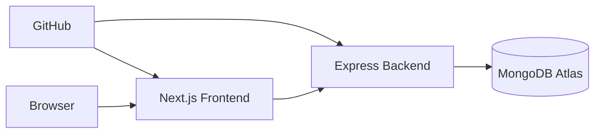
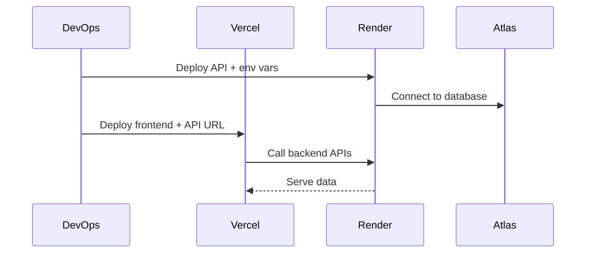

# Deployment Guide

This document describes the recommended production deployment model for SPID using Vercel, Render, and MongoDB Atlas.

## Recommended Production Topology

## Production Components

| Layer | Platform | Responsibility |
|---|---|---|
| Frontend | Vercel | Next.js app delivery |
| Backend | Render | API runtime and business logic |
| Database | MongoDB Atlas | persistent operational data |

## 1. MongoDB Atlas Setup

1. Create a cluster
2. Create a database user
3. Add network access
4. Copy the connection string for `MONGODB_URI`

## 2. Backend Deployment On Render

### Render Service Settings

- Root directory: `PROJECT 1/server`
- Build command: `npm install`
- Start command: `npm start`

### Required Backend Environment Variables

| Variable | Example |
|---|---|
| `NODE_ENV` | `production` |
| `PORT` | `10000` |
| `MONGODB_URI` | `<atlas-uri>` |
| `JWT_SECRET` | `<strong-secret>` |
| `JWT_EXPIRE` | `3h` |
| `COOKIE_EXPIRE` | `0.125` |
| `FRONTEND_URL` | `<vercel-url>` |
| `GOOGLE_CLIENT_ID` | optional |
| `GOOGLE_CLIENT_SECRET` | optional |
| `GOOGLE_CALLBACK_URL` | optional |

### Backend Validation

Open:

`https://<render-service>.onrender.com/api/healthz`

Expected:

- JSON success response
- `dbConnected: true`

## 3. Frontend Deployment On Vercel

### Vercel Settings

- Root directory: `PROJECT 1`

### Required Frontend Environment Variables

| Variable | Example |
|---|---|
| `NEXT_PUBLIC_API_URL` | `https://<render-service>.onrender.com/api` |
| `NEXT_PUBLIC_APP_NAME` | `Smart Performance Intelligence Dashboard` |

## 4. Integration Flow

## 5. Production Readiness Checklist

- [ ] backend `/api/healthz` returns success
- [ ] frontend points to production backend URL
- [ ] `FRONTEND_URL` exactly matches the frontend host
- [ ] login works
- [ ] admin approvals page works
- [ ] students/faculty/performance pages load
- [ ] no browser CORS errors
- [ ] Google OAuth works if enabled

## 6. Cold Start Notes

If using a free Render instance:

- the service may sleep when idle
- first request may take 10 to 30 seconds
- login can look slow if the service is waking up

Mitigation already documented in the repo:

- use the health endpoint for keepalive
- optionally configure a scheduled ping workflow

## 7. Common Production Issues

### CORS blocked

Cause:

- frontend URL does not match `FRONTEND_URL`

Fix:

- update the exact deployed frontend origin in backend environment variables
- redeploy backend

### Frontend cannot reach backend

Cause:

- `NEXT_PUBLIC_API_URL` missing `/api`

Fix:

- ensure the variable ends with `/api`

### Auth works locally but not in production

Cause:

- wrong callback URL or secret mismatch

Fix:

- verify JWT secret, Google callback URL, and deployed frontend URL

## 8. Go-Live Checklist

- [ ] build succeeds on Vercel
- [ ] backend startup logs are healthy on Render
- [ ] database accepts production connection
- [ ] login and protected routes work
- [ ] dashboard data renders
- [ ] student and performance workflows are functional

## 9. Reviewer-Friendly Deployment Summary

This project is deployable in a standard modern web stack:

- frontend and backend are independently deployable
- the backend is stateless and suitable for managed hosting
- database hosting is externalized to Atlas
- environment variables are documented cleanly

## Document Metadata

- Last Updated: April 1, 2026
- Status: Production Blueprint
