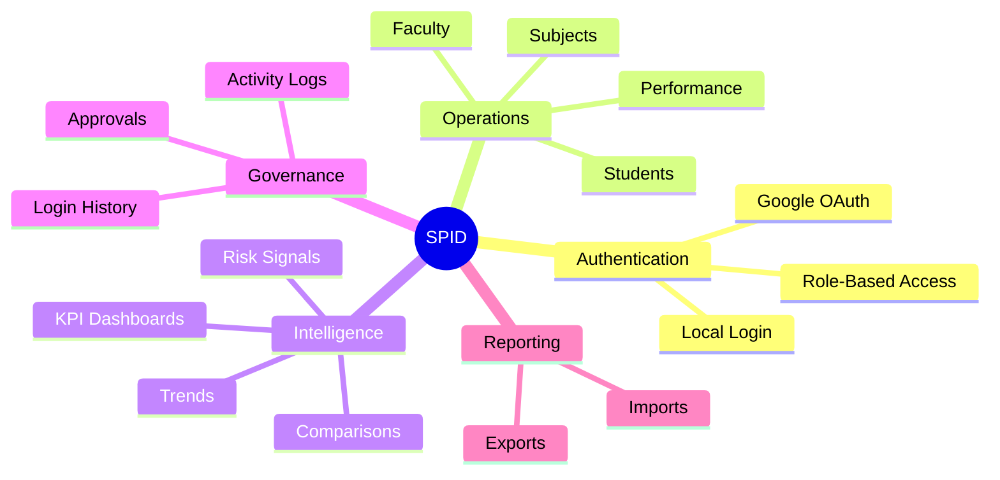
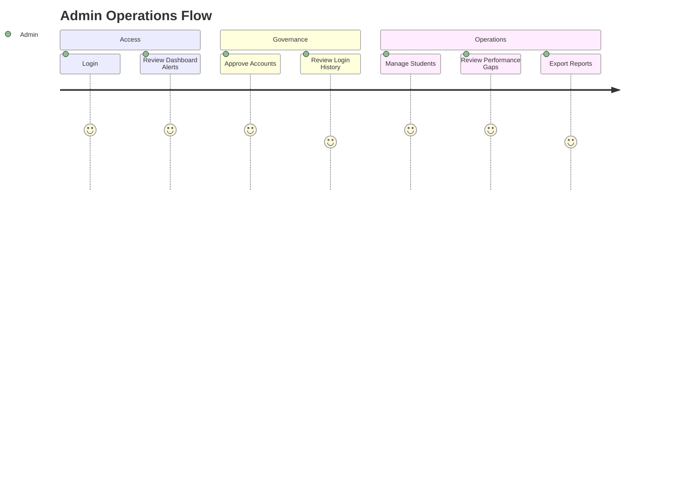
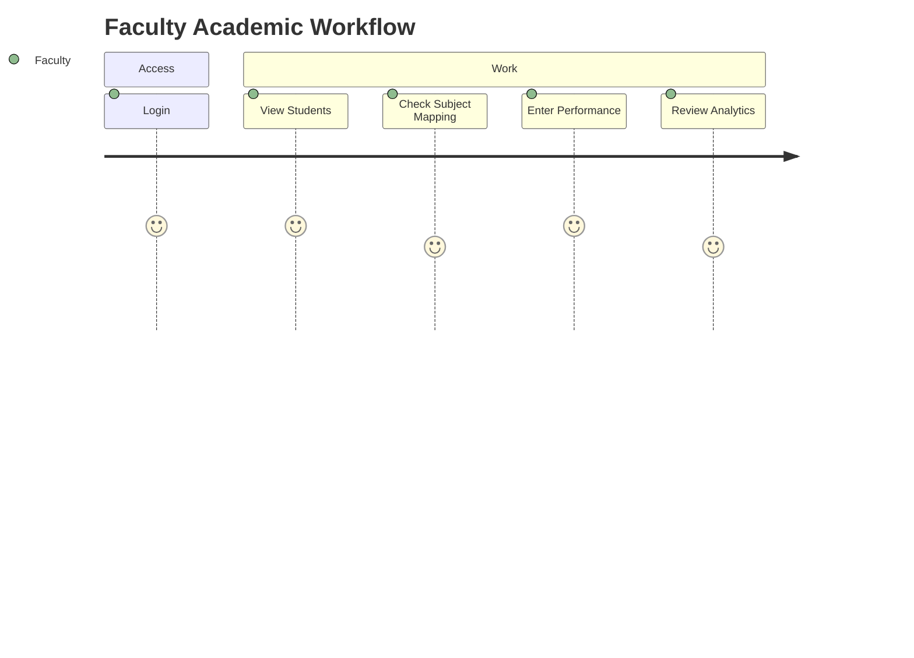
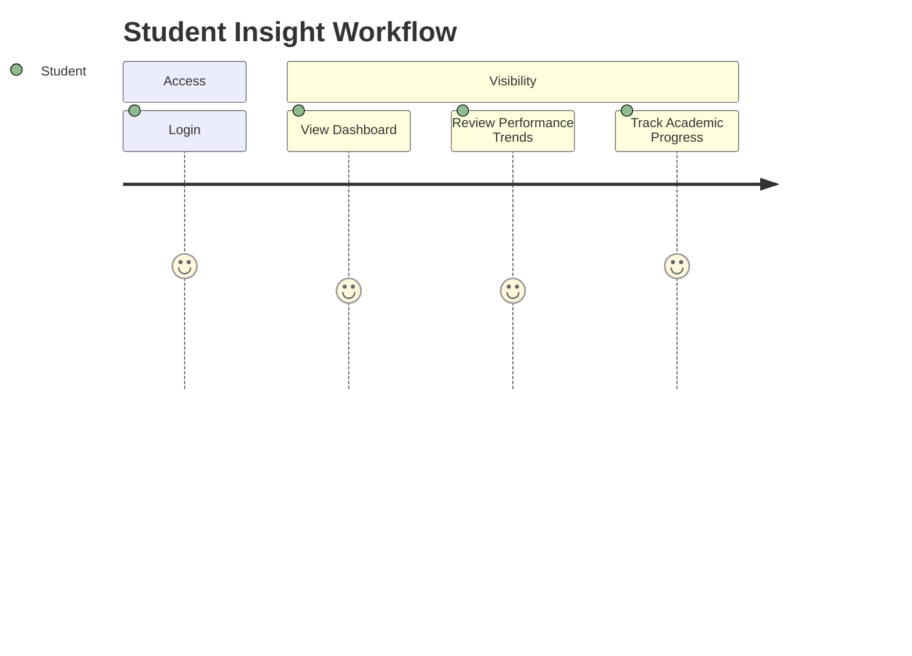
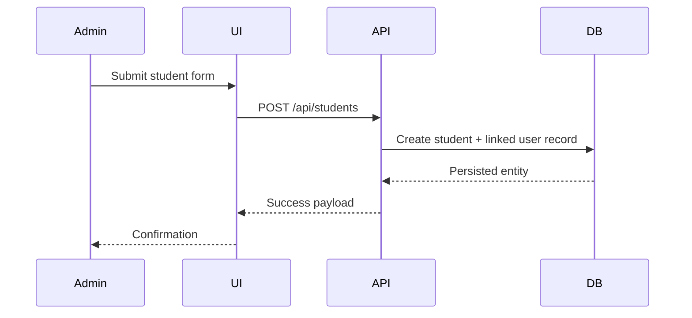
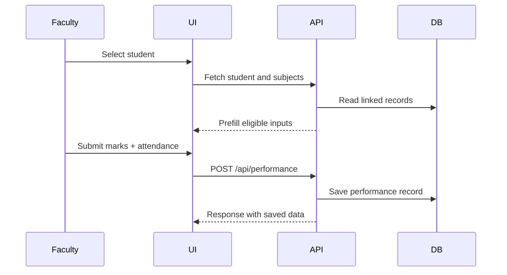

# Features Catalog

This document describes the functional and product-facing capability set of SPID in a way that is useful for reviewers, recruiters, and engineering collaborators.

## Capability Map

## Functional Overview By Domain

### 1. Authentication and Access Control

- Local login with email, user ID, and register-number oriented handling
- Google OAuth integration
- JWT-based auth with refresh/session handling
- Role-based permissions enforced in backend middleware
- Account blocking and pending-approval restrictions

### 2. Admin Approval Workflow

- New viewers enter the system in a pending state
- Admin can review pending access requests
- Admin can approve or reject requests
- Unapproved users are prevented from gaining operational access

### 3. Student Management

- Create, view, edit, and delete student records
- Filter by department, year, semester, and status
- Navigate from student list to profile and analytics views
- Manage lifecycle state transitions such as active/inactive/suspended

### 4. Student Intelligence Views

- Student profile overview
- Analytics and trend views
- Attendance and academic summaries
- Risk-focused context for intervention workflows

### 5. Faculty Management

- Faculty list and lifecycle management
- Designation, bio, expertise, and profile metadata
- Faculty-level operational insights
- Admin-controlled create/update/delete flow

### 6. Subject Management

- Subject definitions and grouped assignment models
- Department/year/semester-based subject mapping
- Student-subject linking through operational workflows

### 7. Performance Management

- Performance record creation and updates
- Marks, grade, attendance, and semester handling
- Missing-performance views and remediation workflows
- Dashboard consumption of performance aggregates

### 8. Dashboard and Analytics

- KPI cards for operational metrics
- Performance trends and distribution charts
- Department comparisons
- Attendance/performance correlation views
- Student and institution-level analytics screens

### 9. Command Center

- Pending approvals queue
- Weak-department visibility
- Missing performance visibility
- Import issue alerts
- Recent anomalies and urgent action queues

### 10. Governance and Audit

- Login history screen
- Activity timeline
- Administrative action traceability
- Security-relevant operational visibility

### 11. Data Import and Export

- Import-preview workflows
- Commit flows for data updates
- Export support for filtered reporting use cases

## User Journey Summary

### Admin Journey

### Faculty Journey

### Student Journey

## Operational Flow Examples

### Student Creation

### Performance Entry

## API Domain Map

| Domain | Route Base | Purpose |
|---|---|---|
| Auth | `/api/auth` | login, register, refresh, approvals |
| Students | `/api/students` | student lifecycle and profiles |
| Faculty | `/api/faculty` | faculty lifecycle and insights |
| Subjects | `/api/subjects` | subject assignment and mapping |
| Performance | `/api/performance` | marks, attendance, records |
| Dashboard | `/api/dashboard` | KPIs, charts, summaries |
| Academic | `/api/academic` | SGPA/CGPA and academic records |
| AI Analytics | `/api/ai-analytics` | risk and insight endpoints |
| Activities | `/api/activities` | logs, timelines, login history |
| Import | `/api/import` | data preview and commit workflows |

## Non-Functional Strengths

- Consistent route segmentation by domain
- Local startup scripts for quick onboarding
- Centralized API client usage on frontend
- Audit and governance features uncommon in student projects
- Test/build/lint workflow already integrated

## Reviewer Talking Points

- This is a multi-role system, not a single-role dashboard
- The project includes both operational control and analytical insight
- Governance features make it feel closer to a real internal enterprise tool
- The documentation, diagrams, and validation workflow indicate project maturity

## Document Metadata

- Last Updated: April 1, 2026
- Status: Active
