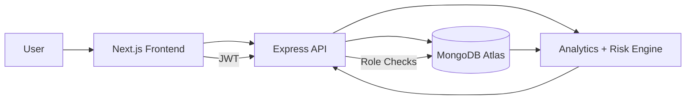
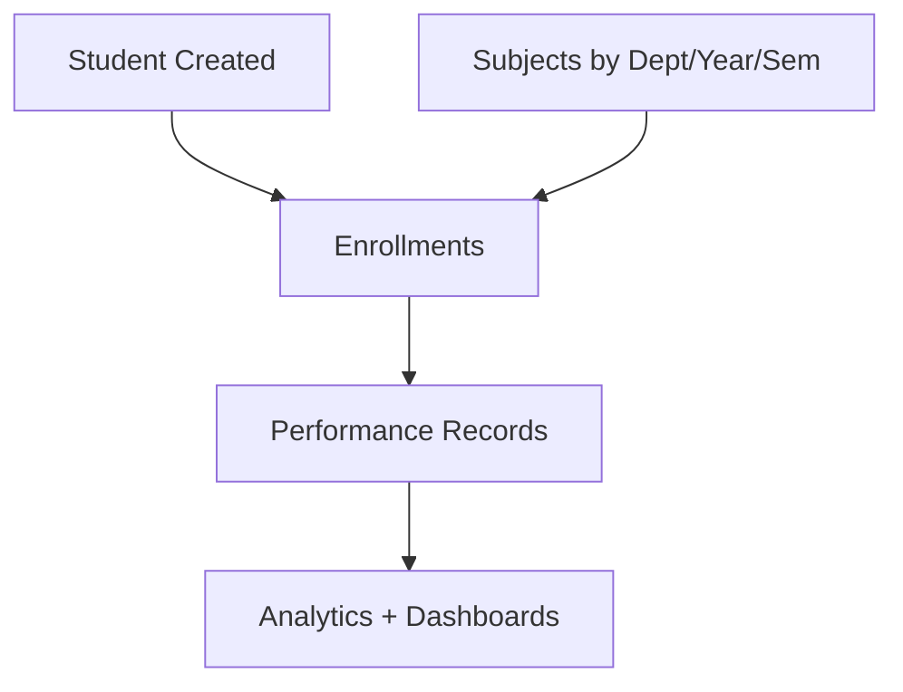

# Smart Performance Intelligence Dashboard (SPID)

SPID is a production-ready academic intelligence platform for managing students, faculty, subjects, performance records, and governance workflows at scale. It combines operational administration with analytics so institutions can track outcomes, intervene early, and report reliably.


## What This System Solves
- Keeps student, subject, and performance data synchronized across modules.
- Reduces manual entry with linked entities and auto-populated fields.
- Provides role-aware dashboards for admins, faculty, and students.
- Turns raw records into actionable risk signals and intervention checklists.

## Platform Highlights
- Student 360 profile with trends, risk timeline, and advisor notes.
- Command Center with actionable cards and an urgent queue.
- Performance analytics with filters, KPIs, and trend visuals.
- Governance workflows: approvals, login history, and activity logs.
- Role-aware access control with strict backend enforcement.

## Live URLs
- Frontend (Vercel): `https://smart-performance-dashboard-git-main-srixenos-projects.vercel.app`
- Backend health (Render): `https://<your-render-service>.onrender.com/api/healthz`

## Technology Stack
- Frontend: Next.js (App Router), React, TypeScript, Tailwind CSS, Chart.js
- Backend: Node.js, Express, Mongoose, JWT, Passport Google OAuth
- Database: MongoDB Atlas
- Hosting: Vercel (frontend), Render (backend)

## Monorepo Structure
```text
PROJECT 1/
  src/                       Next.js frontend
    app/                     Routes/pages
    components/              UI and dashboards
    context/                 Auth context
    lib/                     API client layer
  server/                    Express API
    src/
      config/                DB + passport
      controllers/           Business logic
      middleware/            Auth + role middleware
      models/                Mongo schemas
      routes/                API routes
  README.md
  FEATURES.md
  SETUP.md
  DEPLOYMENT.md
```

## Role and Access Model
| Role | Access |
|---|---|
| `admin` | Full management access, approvals, governance, exports |
| `faculty` | Student view/edit, performance input, student actions |
| `student` | Student-scoped analytics and personal data |
| `viewer` | Pending users awaiting admin approval |

## Core Modules
- Authentication (`local + Google OAuth`)
- Students (CRUD, status controls, 360 profiles)
- Faculty (admin-managed lifecycle)
- Subjects (department/year/semester assignment)
- Performance (records, trends, risk signals)
- Analytics (dashboard metrics, faculty insights)
- Governance (approvals, login history, activity audit)

Detailed list: see `FEATURES.md`.

## System Workflow


## Academic Data Flow


## Screens and Visuals


## Local Development (Quick)
```powershell
Copy-Item .env.example .env
Copy-Item server/.env.example server/.env
.\install_all.bat
.\start_project.bat
```

Manual run:
```bash
# terminal 1
cd server
npm install
npm run seed
npm run dev

# terminal 2 (project root)
npm install
npm run dev
```

Local URLs:
- Frontend: `http://localhost:3000`
- Backend API: `http://localhost:5000/api`
- Health: `http://localhost:5000/api/healthz`

## Environment Variables
### Frontend (`.env.local`)
- `NEXT_PUBLIC_API_URL` (example: `https://<render-service>.onrender.com/api`)
- `NEXT_PUBLIC_APP_NAME`

### Backend (`server/.env`)
- `PORT`
- `NODE_ENV`
- `MONGODB_URI`
- `JWT_SECRET`
- `JWT_EXPIRE`
- `COOKIE_EXPIRE`
- `FRONTEND_URL`
- `GOOGLE_CLIENT_ID`
- `GOOGLE_CLIENT_SECRET`
- `GOOGLE_CALLBACK_URL`

## API Surface (High Level)
- `/api/auth`
- `/api/students`
- `/api/faculty`
- `/api/subjects`
- `/api/performance`
- `/api/dashboard`
- `/api/academic`
- `/api/ai-analytics`
- `/api/activities`

## Documentation
- `FEATURES.md`
- `SETUP.md`
- `DEPLOYMENT.md`

## License
Academic and portfolio usage.

## Document Metadata
- Last Updated: March 12, 2026
- Status: Active
