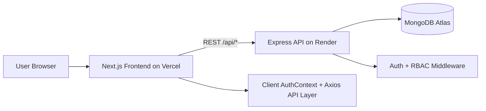

# Smart Performance Dashboard (SPID)

## Documentation Hub
- Main Overview: [`README.md`](README.md)
- Architecture: [`ARCHITECTURE.md`](ARCHITECTURE.md)
- Setup: [`SETUP.md`](SETUP.md)
- Quick Start: [`QUICK_START.md`](QUICK_START.md)
- Deployment Guide: [`DEPLOYMENT.md`](DEPLOYMENT.md)
- Deployment Checklist: [`DEPLOYMENT_CHECKLIST.md`](DEPLOYMENT_CHECKLIST.md)
- Deployment Quick Reference: [`DEPLOYMENT_QUICK_REFERENCE.md`](DEPLOYMENT_QUICK_REFERENCE.md)
- Documentation Index: [`DOCUMENTATION_INDEX.md`](DOCUMENTATION_INDEX.md)
- Enterprise Report: [`ENTERPRISE_TRANSFORMATION.md`](ENTERPRISE_TRANSFORMATION.md)
- Executive Summary: [`TRANSFORMATION_SUMMARY.md`](TRANSFORMATION_SUMMARY.md)

[](https://smart-performance-dashboard-git-main-srixenos-projects.vercel.app)


Professional full-stack college performance platform with role-based access, analytics dashboards, student/faculty management, and deployment-ready architecture.

## Live URLs
- Application: `https://smart-performance-dashboard-git-main-srixenos-projects.vercel.app`
- Transformation Summary (document): `https://github.com/SRIXENO/Smart-performance-dashboard/blob/main/PROJECT%201/TRANSFORMATION_SUMMARY.md`

## Table of Contents
- [Key Features](#key-features)
- [Visual Preview](#visual-preview)
- [Architecture Diagram](#architecture-diagram)
- [Tech Stack](#tech-stack)
- [Project Structure](#project-structure)
- [Roles and Access](#roles-and-access)
- [Local Setup](#local-setup)
- [Environment Variables](#environment-variables)
- [API Overview](#api-overview)
- [Deployment](#deployment)
- [Troubleshooting](#troubleshooting)
- [Documentation](#documentation)

## Key Features
- JWT and cookie-based authentication
- Google OAuth login support
- Role-aware controls (`admin`, `faculty`, `student`)
- Student and faculty management modules
- Academic and performance analytics
- Activity and login history tracking
- Responsive layout for desktop, split-screen, and mobile
- Light and dark mode support

## Visual Preview
These visuals are included in the repository (`public/docs`):


## Architecture Diagram


## Tech Stack
### Frontend
- Next.js (App Router)
- React + TypeScript
- Tailwind CSS
- Axios
- Chart.js

### Backend
- Node.js + Express
- MongoDB + Mongoose
- JWT + Cookies
- Passport (Google OAuth)

## Project Structure
```text
PROJECT 1/
  src/                              Next.js frontend
    app/                            Routes and pages
    components/                     Reusable UI components
    context/                        Global auth and state
    lib/                            API layer and utilities
  server/                           Express backend
    src/
      controllers/                  Business logic
      middleware/                   Auth and role validation
      models/                       Mongoose schemas
      routes/                       API endpoints
      config/                       DB and passport config
  public/                           Static assets
    docs/                           README preview visuals
  README.md
  QUICK_START.md
  SETUP.md
  ARCHITECTURE.md
  DEPLOYMENT.md
  DEPLOYMENT_QUICK_REFERENCE.md
  DEPLOYMENT_CHECKLIST.md
  DOCUMENTATION_INDEX.md
  ENTERPRISE_TRANSFORMATION.md
  TRANSFORMATION_SUMMARY.md
```

## Roles and Access
- Admin:
  - Full create/update/delete access for protected modules
  - Access to admin monitoring and history
- Faculty:
  - View access across major modules
  - Limited write actions based on backend policy
- Student:
  - View-only access to allowed areas

## Local Setup
### Prerequisites
- Node.js `18+`
- npm `9+`
- MongoDB Atlas connection string

### Quick setup (Windows)
```powershell
Copy-Item .env.example .env
Copy-Item server/.env.example server/.env
.\install_all.bat
.\start_project.bat
```

### Local URLs
- Frontend: `http://localhost:3000`
- Backend API: `http://localhost:5000/api`
- Health: `http://localhost:5000/api/health`

### Manual alternative
Backend:
```bash
cd server
npm install
npm run seed
npm run dev
```

Frontend:
```bash
npm install
npm run dev
```

## Environment Variables
### Frontend (`.env.local` / Vercel)
- `NEXT_PUBLIC_API_URL` (example: `https://smart-performance-dashboard.onrender.com/api`)
- `NEXT_PUBLIC_APP_NAME`

### Backend (`server/.env` / Render)
- `NODE_ENV`
- `PORT`
- `MONGODB_URI`
- `JWT_SECRET`
- `JWT_EXPIRE`
- `COOKIE_EXPIRE`
- `FRONTEND_URL`
- `GOOGLE_CLIENT_ID`
- `GOOGLE_CLIENT_SECRET`
- `GOOGLE_CALLBACK_URL`

## API Overview
- `/api/auth`
- `/api/students`
- `/api/faculty`
- `/api/subjects`
- `/api/performance`
- `/api/dashboard`
- `/api/academic`
- `/api/ai-analytics`
- `/api/activities`

## Deployment
Production deployment model:
- Frontend: Vercel
- Backend: Render
- Database: MongoDB Atlas

Primary production URL:
- `https://smart-performance-dashboard-git-main-srixenos-projects.vercel.app`

For full deployment steps, use:
- `DEPLOYMENT.md`
- `DEPLOYMENT_CHECKLIST.md`
- `DEPLOYMENT_QUICK_REFERENCE.md`

## Troubleshooting
### App stuck on `Loading...`
- Verify backend health endpoint responds.
- Verify `NEXT_PUBLIC_API_URL` includes `/api`.
- Check browser network for `/auth/me` failures.
- Check Render logs for cold-start or runtime errors.

### CORS issues
- Set backend `FRONTEND_URL` exactly to your Vercel URL.
- Redeploy backend after env changes.

### Login issues
- Verify JWT/cookie env values are present.
- Verify OAuth callback URL (if Google login is enabled).

## Documentation
- `DOCUMENTATION_INDEX.md` - full doc map
- `ARCHITECTURE.md` - technical architecture
- `SETUP.md` - detailed setup guide
- `QUICK_START.md` - fastest local run path
- `ENTERPRISE_TRANSFORMATION.md` - transformation details
- `TRANSFORMATION_SUMMARY.md` - executive summary

## License
For academic, portfolio, and demonstration use.

## Document Metadata
- Version: `2.0`
- Last Updated: `February 24, 2026`


