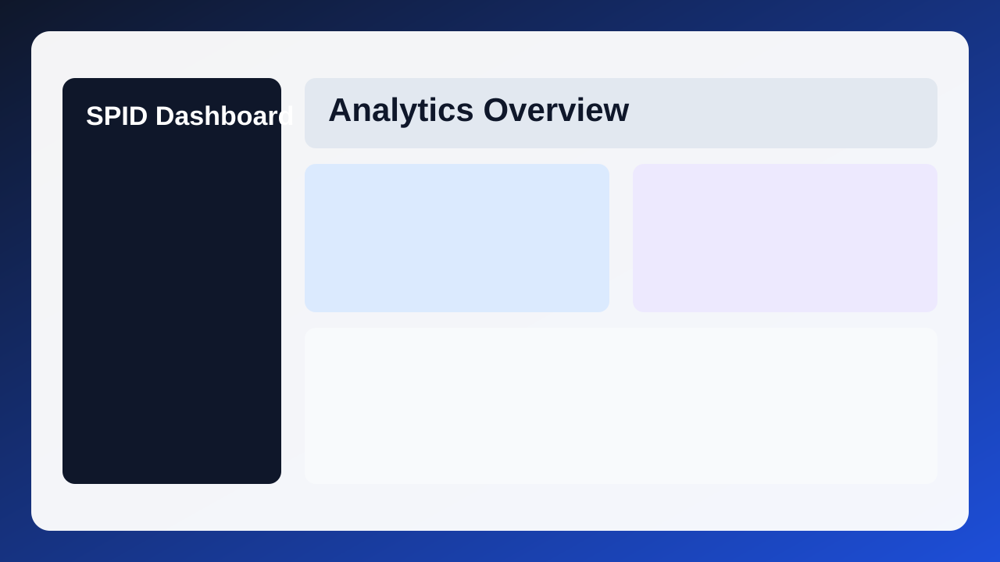
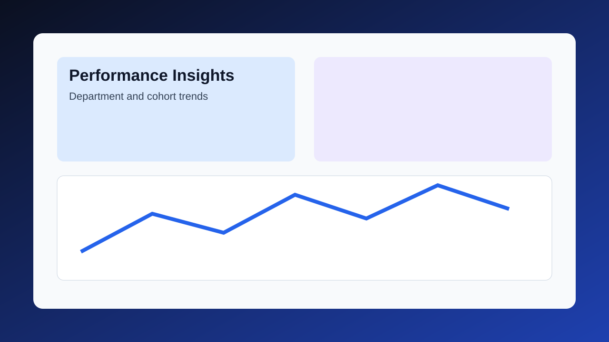
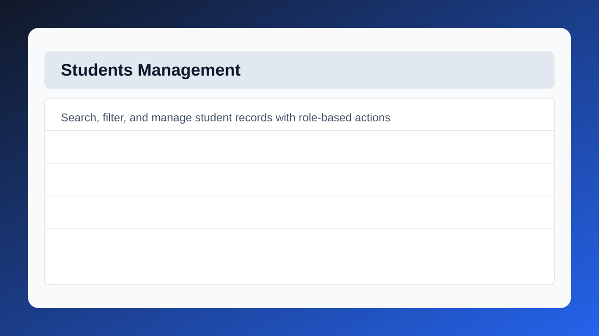
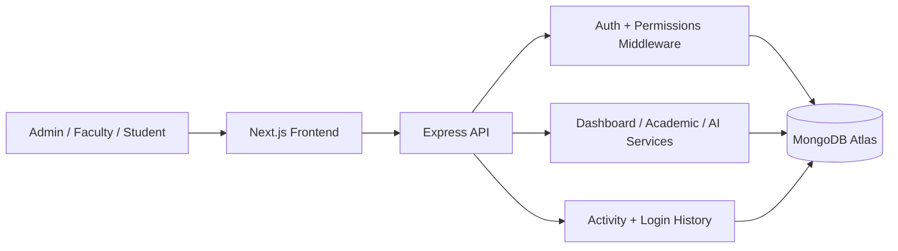
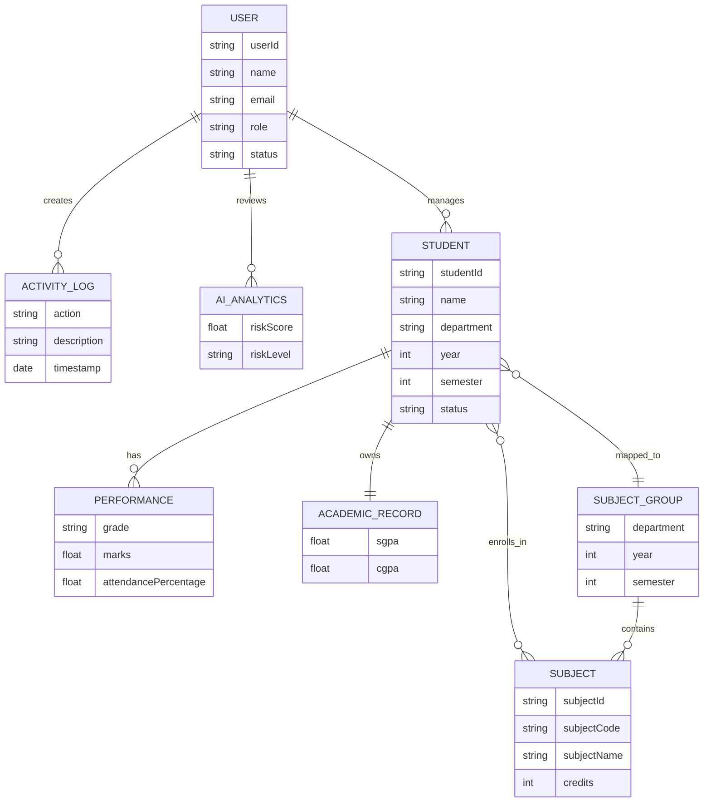

# Smart Performance Intelligence Dashboard

Smart Performance Intelligence Dashboard (SPID) is a full-stack academic operations and analytics platform built to help institutions manage student records, faculty workflows, subjects, performance data, approvals, audit history, and insight-driven decision making from a single system.

It is designed as a portfolio-grade product: not just CRUD screens, but an operational platform with role-aware access, analytics dashboards, administrative controls, and a scalable domain structure across frontend and backend layers.

## Why This Project Stands Out

- Solves a real operational problem instead of a toy problem
- Combines administration, analytics, governance, and reporting
- Uses a modern full-stack architecture with clean domain separation
- Includes authentication, auditability, approvals, and dashboard intelligence
- Ships with local startup scripts, test coverage, and deployment documentation

## Product Snapshot

| Area | What It Delivers |
|---|---|
| Student Operations | Create, update, track, and analyze student records |
| Performance Intelligence | Monitor marks, attendance, risk, and progression |
| Governance | Admin approvals, login history, and activity logging |
| Reporting | Dashboard KPIs, distributions, comparisons, and exports |
| Security | Role-based access, JWT auth, middleware enforcement |

## Visual Preview

### Dashboard Preview


### Performance Module Preview


### Students Module Preview


## Business Problem

Academic institutions often manage student performance through disconnected spreadsheets, isolated portals, or manual reporting. This creates recurring issues:

- student and subject data drift out of sync
- identifying at-risk students becomes reactive instead of proactive
- approvals and account governance are hard to audit
- dashboards depend on manual reconciliation
- role boundaries are inconsistently enforced

SPID addresses these gaps by centralizing the operational workflow and analytics layer in one application.

## Core Capabilities

- Role-based authentication with local login and Google OAuth support
- Student lifecycle management with search, filters, detail pages, and analytics
- Faculty, subject, and performance workflows for academic operations
- Dashboard metrics, trend charts, and institution-level comparisons
- Command center for approvals, anomalies, weak departments, and missing data
- Login history, activity tracking, and approval governance
- Import/export support for operational reporting

For full capability details, see [FEATURES.md](FEATURES.md).

## Architecture Overview



## Entity Relationship Diagram



## Technology Stack

### Frontend
- Next.js App Router
- React 19
- TypeScript
- Tailwind CSS
- Chart.js / react-chartjs-2

### Backend
- Node.js
- Express.js
- Mongoose
- JWT + cookie-based auth
- Passport Google OAuth

### Data and Hosting
- MongoDB Atlas
- Vercel for frontend
- Render for backend

## Monorepo Structure

```text
PROJECT 1/
  src/
    app/                  App Router pages
    components/           UI and dashboard components
    context/              Auth context
    lib/                  API client, permissions, helpers
    data/                 Mock and utility data
    types/                Shared TypeScript types
  server/
    src/
      config/             DB and passport config
      controllers/        Domain logic
      middleware/         Auth, validation, security
      models/             Mongoose schemas
      routes/             REST API routes
      services/           Analytics and business services
      utils/              Helper utilities
  public/docs/            Preview assets for documentation
  README.md
  FEATURES.md
  SETUP.md
  DEPLOYMENT.md
```

## User Roles

| Role | Primary Access |
|---|---|
| `admin` | Full operational control, approvals, governance, reporting |
| `faculty` | Student access, subject handling, performance workflows |
| `student` | Personal dashboard and student-scoped visibility |
| `viewer` | Awaiting admin approval before activation |

## Recruiter / Reviewer Highlights

- Demonstrates end-to-end ownership of a real product workflow
- Shows frontend, backend, database, auth, analytics, and documentation maturity
- Includes quality gates: lint, tests, production build, audit cleanup
- Uses structured docs, diagrams, and deployment guidance
- Suitable for discussion across product thinking, engineering design, and implementation depth

## Local Setup

```powershell
Copy-Item .env.example .env.local
Copy-Item server/.env.example server/.env
.\install_all.bat
.\start_project.bat
```

Local URLs:

- Frontend: `http://localhost:3000`
- Backend API: `http://localhost:5000/api`
- Health: `http://localhost:5000/api/healthz`

Notes:

- `start_project.bat` forces the frontend to use the local backend URL to avoid stale hosted API configuration.
- If PowerShell blocks `npm`, use the provided batch scripts or `npm.cmd`.

## Demo Accounts

Use the seed script for a ready-to-review dataset:

```bash
npm --prefix server run seed
```

- Admin: `admin@xeno.com / adminsrixeno`
- Faculty: `faculty@spid.com / faculty123`
- Student: `aarya.sharma@spid.com / student123`
- Viewer approval queue: `viewer@spid.com / viewer123`

## Verification

```bash
npm run check
```

This runs:

- lint
- backend test suite
- production build

## Deployment

Production deployment is documented in [DEPLOYMENT.md](DEPLOYMENT.md).

Recommended topology:

- Frontend on Vercel
- Backend on Render
- Database on MongoDB Atlas

## Documentation Guide

- [FEATURES.md](FEATURES.md) for product capability breakdown
- [SETUP.md](SETUP.md) for developer onboarding
- [DEPLOYMENT.md](DEPLOYMENT.md) for production rollout
- [Smart-performance-dashboard/DOCUMENTATION_INDEX.md](Smart-performance-dashboard/DOCUMENTATION_INDEX.md) for the technical appendix set

## Submission Readiness Checklist

- [x] Local startup flow verified
- [x] Production build verified
- [x] Backend test suite passing
- [x] Lint passing
- [x] Security audit passing
- [x] Documentation refreshed with diagrams and visuals

## License

Portfolio, academic, and demonstration use.

## Document Metadata

- Last Updated: April 1, 2026
- Status: Submission Ready
