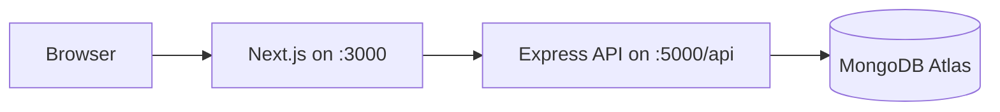
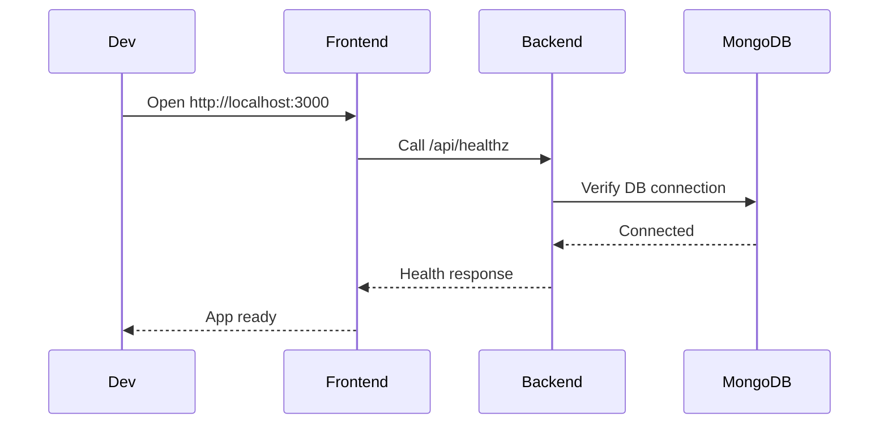

# Setup Guide

This guide is the fastest way to get SPID running locally with a clean, repeatable workflow.

## Local Development Architecture



## 1. Prerequisites

- Node.js 18+
- npm 9+
- MongoDB Atlas connection string
- Windows environment for `.bat` workflow, or terminal access for manual run

## 2. Environment Setup

Create local environment files:

```powershell
Copy-Item .env.example .env.local
Copy-Item server/.env.example server/.env
```

### Frontend Variables

| Variable | Purpose | Example |
|---|---|---|
| `NEXT_PUBLIC_API_URL` | backend base URL | `http://localhost:5000/api` |
| `NEXT_PUBLIC_APP_NAME` | app label | `Smart Performance Intelligence Dashboard` |

### Backend Variables

| Variable | Purpose |
|---|---|
| `PORT` | backend port |
| `NODE_ENV` | runtime environment |
| `MONGODB_URI` | database connection string |
| `JWT_SECRET` | auth signing secret |
| `JWT_EXPIRE` | token expiry window |
| `COOKIE_EXPIRE` | cookie expiry |
| `FRONTEND_URL` | trusted frontend origin |
| `GOOGLE_CLIENT_ID` | optional OAuth |
| `GOOGLE_CLIENT_SECRET` | optional OAuth |
| `GOOGLE_CALLBACK_URL` | optional OAuth callback |

## 3. Install Dependencies

### Recommended

```powershell
.\install_all.bat
```

This script:

- installs frontend dependencies
- installs backend dependencies
- seeds the backend database

### Manual Alternative

```bash
npm install
cd server
npm install
npm run seed
```

## 4. Start The Application

### Recommended

```powershell
.\start_project.bat
```

Why this is preferred:

- starts backend and frontend in separate windows
- forces frontend traffic to the local backend
- avoids accidental calls to stale hosted API endpoints

### Manual Startup

Backend:

```bash
cd server
npm run dev
```

Frontend:

```bash
npm run dev
```

## 5. Verify Local Runtime

- Frontend: `http://localhost:3000`
- Backend API: `http://localhost:5000/api`
- Health: `http://localhost:5000/api/healthz`

Quick health check:

```powershell
Invoke-WebRequest http://localhost:5000/api/healthz
```

## 6. Local Validation Checklist

- [ ] `npm run lint` succeeds
- [ ] `npm run test:server` succeeds
- [ ] `npm run build` succeeds
- [ ] login works
- [ ] dashboard loads
- [ ] students page loads
- [ ] subjects page loads
- [ ] faculty page loads
- [ ] performance page loads
- [ ] admin approvals page loads for admin account

Or run the all-in-one command:

```bash
npm run check
```

## 7. Known Good Local Flow



## 8. Common Setup Problems

### Warmup or backend unavailable message during local run

Cause:

- frontend is pointing to an old hosted backend instead of local backend

Fix:

- use `.\start_project.bat`
- confirm `NEXT_PUBLIC_API_URL=http://localhost:5000/api`

### Backend does not start

Check:

- `server/.env` exists
- `MONGODB_URI` is valid
- port `5000` is free

### Frontend starts but API calls fail

Check:

- backend health endpoint responds
- `NEXT_PUBLIC_API_URL` includes `/api`
- browser console has no CORS mismatch

### Seed fails

Check:

- DB credentials
- Atlas allowlist/network settings
- run `npm run seed` in `server/` manually for direct error output

## 9. Demo Accounts

If seeded locally, the backend seed script creates example accounts such as:

- `admin@spid.com / admin123`
- `faculty@spid.com / faculty123`

## 10. Recommended Demo Order

1. Login
2. Dashboard
3. Students
4. Subjects
5. Faculty
6. Performance
7. Admin approvals / login history

## Document Metadata

- Last Updated: April 1, 2026
- Status: Active
