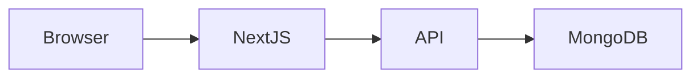

# Setup Guide

This guide covers local development for both the Next.js frontend and the Express API.

## 1. Prerequisites
- Node.js 18+
- npm 9+
- MongoDB Atlas cluster and connection string

## 2. Environment Files
From project root:

```powershell
Copy-Item .env.example .env.local
Copy-Item server/.env.example server/.env
```

### Frontend variables (`.env.local`)
- `NEXT_PUBLIC_API_URL`
- `NEXT_PUBLIC_APP_NAME`

### Backend variables (`server/.env`)
- `PORT`
- `NODE_ENV`
- `MONGODB_URI`
- `JWT_SECRET`
- `JWT_EXPIRE`
- `COOKIE_EXPIRE`
- `FRONTEND_URL`
- `GOOGLE_CLIENT_ID`
- `GOOGLE_CLIENT_SECRET`
- `GOOGLE_CALLBACK_URL`

## 3. Install Dependencies
### Option A: Helper script
```powershell
.\install_all.bat
```

### Option B: Manual
```bash
npm install
cd server
npm install
```

## 4. Seed Data (optional but recommended)
```bash
cd server
npm run seed
```

## 5. Run Development
### Option A: Helper script
```powershell
.\start_project.bat
```

This script starts both services and forces the frontend to use the local backend URL, which avoids accidental calls to an old hosted API during development.

### Option B: Manual
```bash
# terminal 1
cd server
npm run dev

# terminal 2
npm run dev
```

## 6. Verify Local Runtime
- Frontend: `http://localhost:3000`
- Backend: `http://localhost:5000/api`
- Health: `http://localhost:5000/api/healthz`

## 7. Validation Checklist
- [ ] `npm run lint` succeeds at root
- [ ] `npm run build` succeeds at root
- [ ] `npm run test:server` succeeds
- [ ] Login works for known account
- [ ] Students and Faculty pages load
- [ ] Role restrictions behave as expected
- [ ] Approvals page loads for admin

## 8. Common Setup Errors
- Missing `/api` in `NEXT_PUBLIC_API_URL`
- Wrong `FRONTEND_URL` format in backend env
- Missing OAuth env values when Google auth is enabled
- Using stale Atlas credentials or allowlist

## 9. Local Debugging Tips
- If login hangs, verify backend health and CORS config.
- If the browser shows backend warmup messages while running locally, confirm the frontend is using `http://localhost:5000/api`.
- If analytics show zeros, confirm sample data exists and performance records are linked.
- If dropdowns are empty, confirm departments/subjects exist in DB.

## 10. Local Architecture Overview


## Document Metadata
- Last Updated: March 12, 2026
- Status: Active
